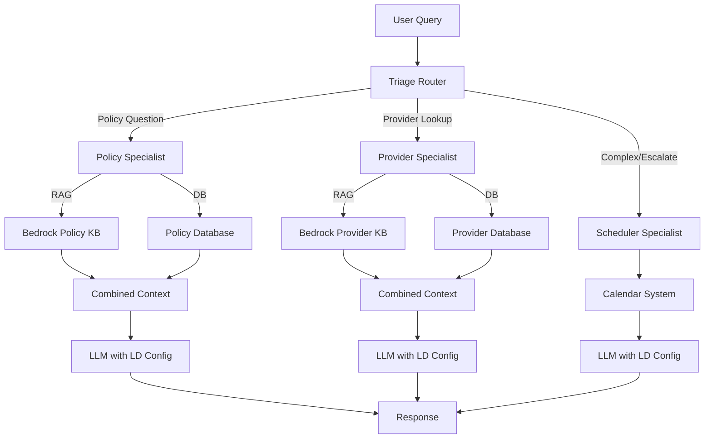

# Medical Insurance Support Multi-Agent System

A production-ready LangGraph-based multi-agent system for intelligent medical insurance customer support. Features LaunchDarkly AI Config management and AWS Bedrock Knowledge Base RAG integration.

## 🌟 Features

- 🤖 **Multi-Agent Orchestration** with LangGraph
- 🎯 **LaunchDarkly AI Configs** - Dynamic model management per agent
- 📚 **RAG with Bedrock Knowledge Base** - Semantic search over policy & provider docs
- 🔄 **Hybrid Retrieval** - Combines RAG + structured databases
- 💬 **Interactive Terminal Chatbot** - Beautiful UI with extensive debug logging
- 📊 **Observability** - Full metrics tracking via LaunchDarkly
- 🔐 **AWS SSO Integration** - Automatic token refresh
- 🎨 **Production-Ready** - Error handling, fallbacks, logging

## 🚀 Quick Start

### Prerequisites

- Python 3.11+
- AWS CLI configured with SSO
- LaunchDarkly account (free tier works)
- AWS Bedrock access (optional for RAG)

### Installation

```bash
# Clone the repository
git clone https://github.com/marekdarkly/policy_agent.git
cd policy_agent

# Complete setup (installs deps, checks AWS, verifies LaunchDarkly)
make setup
```

### Configuration

1. **Copy and configure .env**:
```bash
cp .env.example .env
# Edit .env with your LaunchDarkly SDK key
```

2. **Required environment variables**:
```bash
LAUNCHDARKLY_ENABLED=true
LAUNCHDARKLY_SDK_KEY=api-your-key-here
AWS_PROFILE=marek
AWS_REGION=us-east-1
```

3. **Optional (for RAG)**:
```bash
BEDROCK_POLICY_KB_ID=your-policy-kb-id
BEDROCK_PROVIDER_KB_ID=your-provider-kb-id
```

### Run the Chatbot

```bash
# Automatically checks AWS credentials and refreshes if needed
make run
```

That's it! The chatbot will:
- ✅ Check your AWS credentials (auto-refresh if expired)
- ✅ Initialize LaunchDarkly AI configs
- ✅ Start the interactive chatbot

## 🎯 Architecture

```
User Query
    ↓
Triage Router (LaunchDarkly: triage_agent)
    ↓
[Routing Decision based on confidence]
    ↓
    ├─→ Policy Specialist (LaunchDarkly: policy_agent)
    │   ├─ RAG: Bedrock KB semantic search
    │   └─ Database: Structured policy data
    │
    ├─→ Provider Specialist (LaunchDarkly: provider_agent)
    │   ├─ RAG: Bedrock KB semantic search
    │   └─ Database: Structured provider data
    │
    └─→ Scheduler Specialist (LaunchDarkly: scheduler_agent)
        └─ Calendar: Available time slots
             ↓
        Final Response
```

### Agent Responsibilities

| Agent | LaunchDarkly Key | RAG Enabled | Purpose |
|-------|-----------------|-------------|---------|
| **Triage Router** | `triage_agent` | ❌ | Query classification and routing |
| **Policy Specialist** | `policy_agent` | ✅ | Coverage, benefits, claims questions |
| **Provider Specialist** | `provider_agent` | ✅ | Find doctors, check network |
| **Scheduler Specialist** | `scheduler_agent` | ❌ | Schedule callbacks, escalate |

## 📖 Documentation

### Essential Guides

- **[LAUNCHDARKLY.md](LAUNCHDARKLY.md)** - LaunchDarkly AI Config setup
- **[BEDROCK_RAG.md](BEDROCK_RAG.md)** - RAG implementation guide
- **[RAG_SETUP_GUIDE.md](RAG_SETUP_GUIDE.md)** - Quick start for Bedrock KB
- **[AWS_BEDROCK.md](AWS_BEDROCK.md)** - Bedrock LLM configuration
- **[SDD.md](SDD.md)** - System Design Document

View all documentation:
```bash
make docs
```

## 🎮 Makefile Commands

### Common Commands

```bash
make run          # Start the chatbot (auto-checks AWS)
make chat         # Alias for 'make run'
make setup        # Complete setup from scratch
make verify       # Verify LaunchDarkly & RAG configs
make check        # Check all configurations
make info         # Show system status
make help         # Show all commands
```

### AWS Management

```bash
make aws-check    # Check AWS credentials (auto-refresh)
make aws-login    # Force AWS SSO login
make aws-info     # Show AWS identity
```

### Development

```bash
make format       # Format code with black
make lint         # Lint with ruff
make typecheck    # Type check with mypy
make quality      # Run all quality checks
make clean        # Remove cache files
```

## 💡 Usage Examples

### Interactive Chatbot

```bash
make run
```

Example session:
```
👤 You: Does my plan cover physical therapy?

🔍 POLICY SPECIALIST: Retrieving policy information
📚 Retrieving policy documents via RAG...
  ✅ Retrieved 5 documents (top score: 0.892)
  📄 Retrieved 5 relevant policy documents via RAG
    Doc 1: Score 0.892, Length 1234 chars
    
🤖 Assistant: Yes, your Gold Plan covers physical therapy with a $50 copay 
per visit, up to 30 visits per year. A referral from your primary care 
physician is required...
```

### Running Examples

```bash
make run-example              # Pre-defined example queries
make run-interactive-example  # Interactive mode with examples
make run-test                 # Quick test with one query
```

### Programmatic Usage

```python
from src.graph.workflow import run_workflow

result = run_workflow(
    user_message="What is my copay for seeing a specialist?",
    user_context={
        "policy_id": "POL-12345",
        "coverage_type": "Gold Plan",
        "network": "Premier Network",
        "location": "Boston, MA"
    }
)

print(result["final_response"])
```

## 🔧 LaunchDarkly AI Configs

### Setup

1. **Create AI Configs** in LaunchDarkly with these keys:
   - `triage_agent` - For query classification
   - `policy_agent` - For policy questions  
   - `provider_agent` - For provider lookup
   - `scheduler_agent` - For scheduling

2. **Configure each with**:
```json
{
  "model": {
    "name": "claude-3-5-sonnet",
    "parameters": {
      "temperature": 0.7,
      "maxTokens": 2000
    }
  },
  "provider": "bedrock",
  "enabled": true
}
```

3. **Verify**:
```bash
make verify-ld
```

See [LAUNCHDARKLY.md](LAUNCHDARKLY.md) for detailed instructions.

## 📚 RAG (Optional but Recommended)

### Why RAG?

- 🎯 **Better Accuracy**: Grounded in comprehensive documentation
- 🔍 **Semantic Search**: Finds relevant info even with different phrasing
- 📈 **Scalability**: Add documents without code changes
- 💡 **Smarter Responses**: Context from actual policy documents

### Quick Setup

1. **Create Bedrock Knowledge Bases** (AWS Console)
2. **Upload documents** to S3
3. **Add KB IDs** to `.env`
4. **Verify**:
```bash
make verify-rag
```

See [RAG_SETUP_GUIDE.md](RAG_SETUP_GUIDE.md) for step-by-step instructions.

### How RAG Works

```
Query: "Does my plan cover physical therapy?"
    ↓
RAG Retrieval (Bedrock KB)
  → Searches policy documents semantically
  → Returns: "Physical Therapy: $50 copay, 30 visits/year, requires referral..."
    ↓
Database Lookup
  → Gets: {copay: "$50", visits_allowed: 30}
    ↓
Combined Context → LLM
    ↓
Response: Comprehensive answer with citations
```

## 📁 Project Structure

```
policy_agent/
├── Makefile                 # 🎯 Main entry point
├── interactive_chatbot.py   # 💬 Interactive terminal UI
├── src/
│   ├── agents/              # 🤖 Agent implementations
│   │   ├── triage_router.py
│   │   ├── policy_specialist.py      # 📚 RAG-enhanced
│   │   ├── provider_specialist.py    # 📚 RAG-enhanced
│   │   └── scheduler_specialist.py
│   ├── graph/               # 🔄 LangGraph workflow
│   │   ├── state.py
│   │   └── workflow.py
│   ├── tools/               # 🛠️ Backend tools
│   │   ├── bedrock_rag.py           # 📚 RAG retrieval
│   │   ├── policy_db.py             # Database
│   │   ├── provider_db.py           # Database
│   │   └── calendar.py
│   └── utils/               # ⚙️ Utilities
│       ├── aws_sso.py               # AWS authentication
│       ├── bedrock_llm.py           # Bedrock LLM wrapper
│       ├── launchdarkly_config.py   # LaunchDarkly integration
│       ├── llm_config.py            # LLM configuration
│       └── prompts.py
├── examples/
│   └── run_example.py       # Example queries
├── verify_ld_configs.py     # LaunchDarkly verification
└── test_rag_integration.py  # RAG testing
```

## 🔍 Debug Logging

The chatbot provides extensive logging showing:

- ✅ **LaunchDarkly**: Which configs retrieved, models used
- ✅ **RAG**: Documents retrieved, relevance scores
- ✅ **Routing**: Which agent handles the query, confidence
- ✅ **AWS**: Credential status, auto-refresh
- ✅ **Performance**: Token usage, latency

Example output:
```
🔍 POLICY SPECIALIST: Retrieving policy information
📚 Retrieving policy documents via RAG...
  ✅ Retrieved 5 documents (top score: 0.892)
🔐 AWS SSO Manager initialized (profile: marek, region: us-east-1)
✅ AWS credentials valid
⚠️  Using default config for 'policy_agent' (config may not exist in LaunchDarkly)
```

## 🎨 Development

### Code Quality

```bash
make format      # Auto-format with black
make lint        # Lint with ruff
make typecheck   # Type check with mypy
make quality     # Run all checks
```

### Adding New Agents

1. Create agent file in `src/agents/`
2. Add agent node to `src/graph/workflow.py`
3. Create LaunchDarkly AI Config
4. Update routing logic in triage router

See [SDD.md](SDD.md) for architecture details.

## 🔐 AWS Authentication

The Makefile automatically manages AWS SSO:

```bash
# make run automatically calls aws-check first
make run
```

If credentials expired:
```
⚠️  AWS credentials expired or invalid
🔄 Refreshing AWS SSO credentials...
[Opens browser for authentication]
✅ AWS SSO login successful!
🚀 Starting chatbot...
```

Manual refresh:
```bash
make aws-login
```

## 🧪 Testing & Verification

```bash
make verify       # Verify all configurations
make verify-ld    # LaunchDarkly AI configs only
make verify-rag   # RAG integration only
make test         # Run all tests
```

## 📊 Observability

### LaunchDarkly Metrics

Automatically tracked for each agent:
- Token usage (input, output, total)
- Response duration
- Success/error rates
- Model performance

View in LaunchDarkly dashboard under AI Configs.

### RAG Metrics

Logged for each retrieval:
- Number of documents retrieved
- Relevance scores
- Document lengths
- Retrieval latency
- Fallback usage

## 🎓 How to Use

### 1. First Time Setup

```bash
make all          # Complete setup from scratch
```

### 2. Daily Use

```bash
make run          # Start chatbot (checks AWS automatically)
```

### 3. Verify Configuration

```bash
make check        # Check AWS, LaunchDarkly, RAG status
make info         # Show current system state
```

### 4. Development

```bash
make format       # Format your code
make quality      # Run quality checks
```

## 🐛 Troubleshooting

### AWS Credentials Expired

```bash
make aws-login    # Force re-authentication
```

### LaunchDarkly Not Working

```bash
make verify-ld    # Check LaunchDarkly configs
```

Issues to check:
- SDK key in `.env` is correct
- AI Configs created in LaunchDarkly with correct keys
- Configs are enabled

### RAG Not Working

```bash
make verify-rag   # Check RAG configuration
```

Issues to check:
- Bedrock KB IDs in `.env`
- Knowledge Bases exist in AWS
- Data sources are synced
- IAM permissions for `bedrock:Retrieve*`

### General Issues

```bash
make info         # Show system status
make clean        # Clear cache
make setup        # Re-run setup
```

## 📦 Dependencies

Core:
- `langgraph` - Multi-agent orchestration
- `langchain` - LLM framework
- `langchain-aws` - AWS Bedrock integration

AWS:
- `boto3` - AWS SDK
- AWS CLI with SSO configured

LaunchDarkly:
- `launchdarkly-server-sdk` - Feature flags
- `launchdarkly-server-sdk-ai` - AI Configs

## 🎯 Example Queries

### Policy Questions
```
• "What is my copay for seeing a specialist?"
• "Does my plan cover physical therapy?"
• "What's my deductible for this year?"
```

### Provider Lookup
```
• "I need to find a cardiologist in Boston"
• "Find me a dermatologist who accepts my insurance"
• "Show me primary care doctors near me"
```

### Scheduling
```
• "I need to speak with someone about my claim"
• "This is urgent, I need help now"
• "Can I schedule a callback?"
```

## 🏗️ System Design

### Multi-Agent Flow

1. **Triage Router** analyzes query → determines type
2. **Specialist Agent** retrieves context (RAG + DB)
3. **LLM Generation** with LaunchDarkly config
4. **Response** with citations and metadata

### LaunchDarkly Integration

Each agent:
- Retrieves its own AI Config from LaunchDarkly
- Uses configured model (can be different per agent)
- Tracks metrics automatically
- Supports A/B testing and dynamic updates

### RAG Integration

Policy & Provider specialists:
- Search Bedrock Knowledge Base semantically
- Retrieve top 5 most relevant documents
- Combine with structured database
- Generate grounded responses

## 🔄 Workflow



## 🎨 Customization

### Add New Agent

1. Create agent file in `src/agents/`
2. Add routing logic in `triage_router.py`
3. Add node to `src/graph/workflow.py`
4. Create LaunchDarkly AI Config with key: `{agent}_agent`

### Modify Prompts

Edit `src/utils/prompts.py` to customize agent behavior.

### Change LLM Models

Update in LaunchDarkly AI Config (no code changes needed):
- Different models per agent
- A/B test configurations
- Dynamic updates

## 📈 Production Deployment

### Environment Variables

```bash
# Required
LAUNCHDARKLY_ENABLED=true
LAUNCHDARKLY_SDK_KEY=api-xxx
AWS_PROFILE=production
AWS_REGION=us-east-1

# Optional RAG
BEDROCK_POLICY_KB_ID=KB123
BEDROCK_PROVIDER_KB_ID=KB456
RAG_TOP_K=5

# LLM Fallbacks (used if LD config missing)
LLM_PROVIDER=bedrock
LLM_MODEL=claude-3-5-sonnet
```

### Deployment Checklist

- [ ] LaunchDarkly AI Configs created for all 4 agents
- [ ] AWS credentials configured (IAM role or SSO)
- [ ] Bedrock Knowledge Bases created and synced (optional)
- [ ] Environment variables configured
- [ ] Dependencies installed: `make install`
- [ ] Configuration verified: `make verify`
- [ ] Test run successful: `make run-test`

### Monitoring

- **LaunchDarkly Dashboard**: View AI Config metrics
- **AWS CloudWatch**: Monitor Bedrock API calls
- **Application Logs**: Debug logs from chatbot

## 🤝 Contributing

1. Fork the repository
2. Create feature branch: `git checkout -b feature/amazing-feature`
3. Make changes and test: `make quality`
4. Commit: `git commit -m 'Add amazing feature'`
5. Push: `git push origin feature/amazing-feature`
6. Create Pull Request

## 📝 License

MIT License - see [LICENSE](LICENSE) file

## 🙏 Acknowledgments

- **LangChain** - LLM framework
- **LangGraph** - Multi-agent orchestration
- **LaunchDarkly** - AI Config management
- **AWS Bedrock** - LLM inference and RAG

## 🚀 Quick Reference Card

```bash
# Start here
make setup        # Initial setup
make run          # Run chatbot

# Verification
make verify       # Check everything
make info         # System status

# Development  
make format       # Format code
make quality      # All checks

# Cleanup
make clean        # Remove cache
make clean-all    # Nuclear option
```

---

**Ready to chat?** Run `make run` and start asking questions! 🎉
